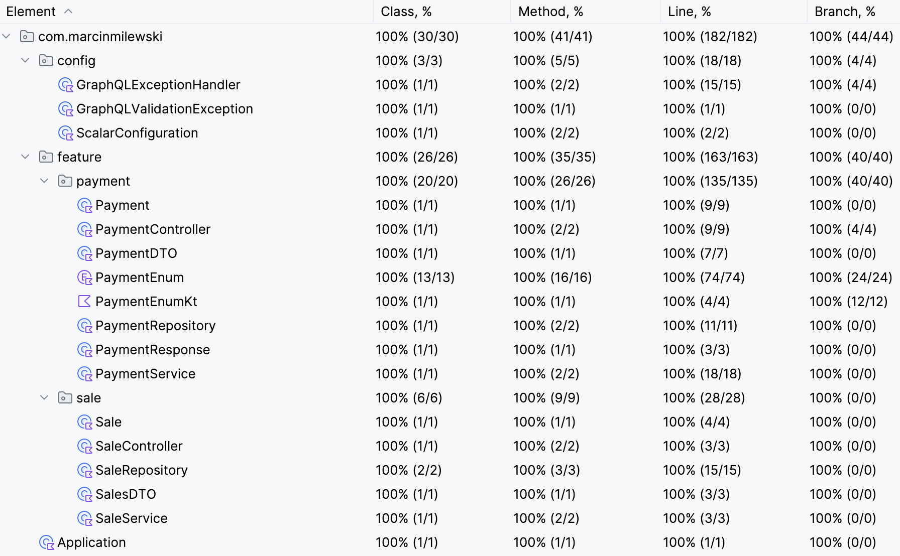

# Application Overview

## Explanation Error Syntax Handling

For error handling, the application follows [GraphQL Specification on Errors](https://spec.graphql.org/October2021/#sec-Errors) to ensure compliance.

I believe the error response codes in the requirements likely originate from translating the original requirements, which were initially designed for a REST API (not GraphQL).

## Running for development

You can start a PostgreSQL container for local development using the following command:

```shell
docker run --name postgres1 -e POSTGRES_DB=payments -e POSTGRES_USER=test -e POSTGRES_PASSWORD=test -p 5432:5432 -d postgres:latest
```

After that, simply start the Spring Boot application in the Application.Main class.

---

## Building and Running the Application with Docker

To package and run the application (which uses PostgreSQL and Java 21), use the following commands:

```shell
mvn package
docker-compose up
```

This will start both PostgreSQL and the application.

---

## Explanation of Design Decision

For configuring payment methods, the following approaches were considered:

1. Using properties or a database with a validation engine for the `additionalItem` fields.
2. Opting for an `Enum` implementation of the **Strategy Pattern**.

Based on principles like:
- **KISS** (Keep It Simple, Stupid)
- **YAGNI** (You Aren’t Gonna Need It)
- **Premature Optimization Is the Root of All Evil**

The `Enum` implementation was chosen to keep the solution simple and maintainable. 

If the configuration changes frequently and needs to support adding PaymentMethods regularly, I would implement a more complex solution:

1. **Store in Database:**  
   Store key attributes such as `paymentMethod`, `pointsModifier`, `priceModifierRange`, and `validationFunction` (which includes logic for validation, the number of fields, field names, and validation regex).

2. **Caching Logic:**  
   Implement caching (likely using Redis) to ensure efficient handling and cleanup, especially when multiple services are involved.

3. **Validation Logic:**  
   Use `javax.validation.ConstraintValidator` annotations to define and handle validation logic.

For an MVP - simplified approach, the above steps were not implemented.

---

## Coverage

36 tests cover 100% of all classes, methods, lines, and branches.



---


## GraphQL API Testing

This project provides a GraphQL API that can be tested locally using the GraphiQL interface.


To test the GraphQL API, navigate to:

```
http://localhost:8080/graphiql?path=/graphql
```

You can use the GraphiQL interface to make various requests.

### Example Requests

#### Mutation: Payment

This mutation processes a payment request.

```graphql
mutation Payment {
  payment(
    request: {
      customerId: "84235",
      price: "200.51",
      priceModifier: 1,
      paymentMethod: "MASTERCARD",
      datetime: "2022-03-01T01:00:00Z",
      additionalItem: {last4: "5555"}
    }
  ) {
    finalPrice
    points
  }
}
```

#### Query: Sales

This query retrieves sales data within a specified time range.

```graphql
query Sales {
  sales(
    request: {
      startTime: "2021-09-01T00:00:00Z",
      endTime: "2023-09-01T00:00:00Z"
    }
  ) {
    datetime
    sales
    points
  }
}
```
